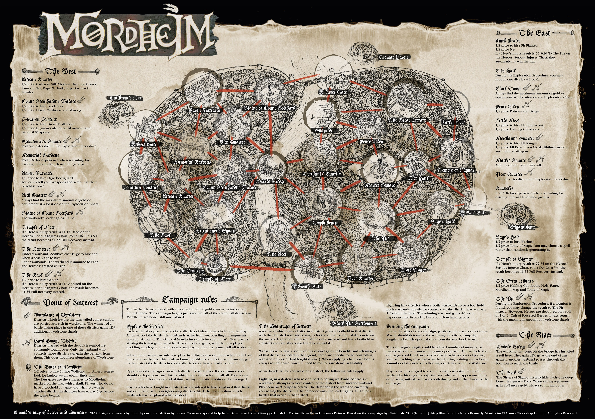

## Map

## Szenarios
[Link](https://github.com/Labernator/Mordheim/tree/master/Old/Return-to-Mordheim/Szenarios)

## Houserules
Quelle: [The New Mordheimer](https://mordheimer.net/docs/house_rules)

**Equipment**
 - **Shields** give +2 to armour save (instead of +1) when in combat (when wielded with a one-handed weapon).
 - **Bucklers** give a +1 to armour save when in combat (when wielded with a one-handed weapon).
 - Increase the cost of **Hammers/Maces/Clubs** to 5 gc.
 - **Slings** are STR 2. Reduce range (to 16").
 - **Armour** is 50% cheaper 
 - **Crossbows** cannot use Quickshot.
 - **Handguns** cause +1 to injury rolls.
 - **Helmet** treats an injury roll of 1-3 as stunned (instead of the additional 4+ roll against stunned)
 - Introduce a new item, **Beat Stick**. It costs 3 gc, and is like a Hammer/Mace but without the Concussion special rule. Alternatively, separate Clubs from Hammers/Maces and remove the rule from clubs (while increasing the cost of Hammer/Maces).
 - **Ranged Weapons**: equipped by max 50% of your warband.
 - **Spears** will always Strike First the first round of combat, even when charged.
 - **Blackpowder weapons**: reduce prices by a third, rounding up.
 - **Lucky Rabbits Foot, Lucky Charm, & Holy/Unholy Relics** are limited to 1 per warband.
 - **Short bows**: Range increased to 20".

**Combat**
 - **Dual wielding**: Both weapons, have -1 to hit. Only heroes may dual wield
 - **Strikes First**: Compare Initiative, then WS, before rolling off
 - **Parry**: Parrying adds WS to roll. For example, a skeleton parries a vampire. The skeleton rolls 4, adds +2 WS so results in 6. The Vampire rolls a 3 and adds +4 WS, so wins with a 7
 - **Critical Hits**: A roll of a 6 to wound no longer causes a critical hit. Instead, if you have wounded the target, roll another d6. On the result of a 6, a critical hit is caused – use the advanced critical tables from the main rulebook. Skaven with the Art of Silent Death skill will cause critical hits on a 5 or 6 as usual on this roll.

**Skills**
 - New common skill, Ambidextrous, avoids dual wielding penalty, and can be taken by any hero during advances. Hired Swords & Dramatis Personae that come with two weapons automatically have this skill.
 - Nurgle's Rot (Carnival of Chaos) is banned

**Campaign**
 - If a warband falls below it's starting value, it immediately receives GC to bring it back to 500 gc (or 600 for Marienburgers).
 - Armor: Light, Heavy, Ithilmar and Gromril suits of armor confer an additional post game save for characters who were taken out of action. If the save is passed the character may choose to not roll on the serious injury chart.
 - Instead of exploring, you can tell your heroes to bring back a body of a fallen friend (all wargear remains to your Warband unless robbed or captured). You roll a D6, on a 4+, it is successful and the fallen comrade is taken out and buried. For each additional hero sent for the one specific fallen, you get +1 to the roll. On a natural roll of 1 it fails.
