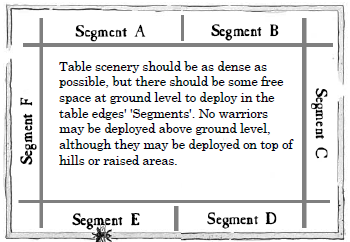

# Hintergrund  

## History  
*Mordheim sits next to the great River Stir, which runs through the town of Waldenhof down from the titanic peaks of the World's Edge Mountains. The city of Mordheim was founded by the Knights of the Order of the Crow thousands of years ago, after the conquest of the land of the Goblins. They called Mordheim to their fortress in memory of their fallen leader, Count Gotthard Angelos.*
*Although the settlement prospered in the commerce (mainly of fish and lumber), the population was composed basically of veteran warriors expert in the handling of the spear, the ax and bow. For centuries, Mordheim was a bulwark in the face of incursions by Orcs and other diabolical creatures that attacked in great numbers from the eastern mountains.*

*Mordheim was one of the few cities in Ostermark that could escape the destruction caused by the Waaagh! from the mighty Orc warlord Gorbad Ironclaw in the year 1707. Each province of the Empire had to send troops to deal with the immense orc invasion and many desperate battles were fought. In the last battle, the soldiers went to the elevated area of the city from which the river flowed and verified that the greenskins of Waaagh! Gorbad approached on the right flank. Most of Mordheim's army perished at the Battle of Camp de Valen, but Count Steinhardt managed to survive and the city was saved while the Waaagh! redirected towards Averheim, which was not so lucky.*
*In the Imperial year 1999 there was a sighting of a great comet in the sky, a Twin Tailed Comet, the sign of Sigmar. Many astronomers predicted the return of Sigmar, and that he would arrive in Mordheim. Massive amounts of people from all corners of the Empire started to travel towards Mordheim, filling the city far beyond its capacity. The morals of the city quickly degenerated into almost nothing, everyone was living a hedonistic life in anarchy, and as more and more people arrived in Mordheim the situation only got worse and worse. When this happened, the seeds of chaos and corruption started to spread among the new citizens of Mordheim, and it wasn't long until daemons walked the streets.*

## The Destruction of Mordheim  
*It happened on New Year's Eve, the comet fell, but it was not the return of Sigmar as predicted. The comet smashed into the city, instantly turning it to rubble and brutally killing everyone who had gathered in and around it. 
People speculated that Sigmar had passed his judgement on the people living in the city, killing them for their unworth.*

## City of the Damned  
*After this event, the place of Mordheim became a place of great fear and paranoia. Word spread about a mysterious stone that was located in the city, known as the Wyrdstone. Many factions of the world would pay a gigantic sum of money in return for the stone. Many warbands began traveling to Mordheim, recently dubbed The City of the Damned, with hopes to find the precious stone.*

# Kampagne

## Szenario 1: The Raven Barracks (S. 213)

### Scenario Houselrules 
-	Wenn zwei Modelle eine Kiste vom Board tragen, erhält nur eines davon die extra Experience. Der Spieler darf bestimmen welches.
-	Wenn eine Warband alle Mitglieder mit Kisten vom Board geschafft hat endet das Spiel. In diesem Fall ist der Gewinner diejenige Warband die am meisten Kisten vom Board geschafft hat.
-	Wenn ein Modell welches eine Kiste trägt out of Action geht, wird die Kiste an der Stelle aufs Feld gestellt.
- Wenn mehr als eine Warband gleichviel (und am meisten) Kisten vom Board schaffen, erhält jeder ihrer Anführer +1 Experience.

Diese Regeln sollen lediglich Lücken im Szenario möglichst intuitiv füllen.

### Setup 
Jeder würfelt mit 3D6. Das legt die Reihenfolge für die Aufstellung fest.  
Aufstellung: Der aktive Spieler sucht sich ein Segment aus (siehe Bild) und platziert seine Warband maximal 6" vom Rand und 6" von einem Mitglied einer anderen Warband entfernt.  

  

Nachdem alle Warbands platziert sind wird nochmal mit 3D6 gewürfelt. Das legt die Spielreihenfolge fest: Höchster Wert zuerst, danach im Uhrzeigersinn.  

Underdog: Aaron hat das niedrigste Warband Rating (73). Als zweitniedrigstes kommt Marius (106). Marius hat (ganz knapp) nicht mehr als 50% von Aarons Rating also gibt es keinen Underdog Bonus.

### Battle Report

* 15 Crates
* Reihenfolge: Kai, Stefan, Aaron, Fabian, Marius

* Snotz killt Waldemar (dead)
* Grumlok killt Ivan (recovery)
* EG killt Wogga (dead)
* Bjørn killt Whitebane  (32: old battle wound)
* Thunderer killt Gaerdor (recovery)
* Innor Kiste
* Igor kiste
* Anulep Suizid (Wahrscheinlichkeit 2-3%!!!!) (recovery)
* Glade Guard killt Gurnch (dead)
* Shade Kiste
* **Laber routet**
* Ug''lash killt Brandaer revive
* Bjorn killt Gaukin (recovery)
* Sissibi Kiste
* Corsair killt Floki (26, minus 1 T)
* Glade Guard killt Ug'lash (recovery)
* Glade Guard killt Roddz (dead)
* Thunderer killt Estedir (recovery)
* Glade Guard Kiste
* **Kai routet**
* Glade Guard Kiste
* Eternal Guard Kiste
* Nesha killt Bjorn (recovery)
* Corsair killt Thunderer (recovery)
* Glade Guard Kiste
* Thunderer Kiste
* Brandaer Kiste
* **Aaron routet**
* Armen Kiste

### Reward:

* Aaron: **15 GC**
* Fabian: **3 Schilde, Schwerter, 3 Thoughened Leathers, Bugman's Ale, 27 GC**
* Laber: **13 GC**
* CZ: **95 GC, Superior Blackpowder, 1 Toughened Leathers**

### Experience:

#### Kai:
- Grumlok +1 (+1 kill)
- Karhag +1
- Grommok +1
- Brothers of Yawn (spear henchmen) +1 (+1 kill): Advance: +1 Ini

#### Aaron: 
- Thunderer: überlebt, Kiste, kill Estedir: +3 (Advance +1S)
- Boss: überlebt, kill: +2
- Bjørn: 2 kills +2

#### Fabian:
- Shade: überlebt, 2 Kisten +3 (Advance +1 BS)
- Corsairs, überlebt, kill +2 (Advance: Lad Got's Talent, +1 W)
- Sorc: üeberlebt,  kill +2 (Advance +1 Ld)
- Sissibibbi: überlebt, Kiste +2 (Advance: Skill Poison Master)
- Lifir: überlebt +1

#### Laber:
- Markus: überlebt +1
- Igor: überlebt, Kiste +2 (Advance Skill: Bellringer)
- Vladimir: überlebt +1

#### CZ:
- Leader: überlebt, Kiste, 2x Szenario +4 (Advance: Skill Haggle)
- Armen: überlebt, Kiste +2 Advance +1 BS
- Eternal Guard: überlebt, Kiste, Kill +3 (Advance: +1 Ini)
- Glade Guard: 3 Kills, 3 Kisten, überlebt +7 (Advance +1 WS, +1 BS)
- Innor: überlebt, Kiste +2 (Advance +1 Wound)

### Exploration:
- Aaron: 2 Shards, verkauft 1: 40 GC
- Fabian: 3 Shards, 2 verkauft: 50 GC
- Kai: 3 Shards, 3 verkauft 70 GC
- Laber: 3 Shards, 3 verkauft 65 GC
- CZ: 4 Shards, 3 verkaufen 65 GC

### Income, Umbau

#### CZ: 160 GC (+1 ubrig vom bauen)
- +1 Searath (fur 12 GC)
- +2 Eternal Guard (90)
- +1 Arabian Merchant (20)
- +4 Dagger (8)
- -> 31 GC übrig

#### Laber: 78 GC (+4 vom bauen)
- +2 Hellhounds (50 GC)
- +1 Bondsman mit Dagger (22)
- +1 Toughened Leathers
- -> 5 GC übrig

#### Aaron: 55 GC (+5 vom Bauen)
- +2 Dwarf Axe (30)
- +1 Light Armour (20)
- -> 10 GC übrig

#### Fabian: 77 GC
- verkauf brewmens ale (+25 GC)
- +1 Sea Dragon Cloak (59)
- +2 Light Armour (40)
- -> 3 GC übrig

#### Kai: 70 GC
- +1 Schamane (40)
- +1 Goblin, Speer, 2 XP, Kurzbogen (29)
- -> 1 GC übrig

## Szenario 2: The Lost Prince (S. 207)

**Scenario Houselrules**  
-	Wenn ein Model in Kontakt mit dem Prinz kommt muss es bis zur nächsten Runde warten um sich mit ihm zu bewegen (der Prinz muss erst überzeugt werden, dass die Retter ihm nichts böses wollen)
-	Das Modell das den Prinz rettet kann sich maximal mit M4 bewegen und nicht rennen (der Prinz ist verletzt)
-	Tiere können den Prinz nicht retten (niemand folgt einem Wolf oder einer Riesenratte…)

Diese Regeln sollen verhindern, dass sich ein Model mit hoher Movement Rate (Wulfen mit Sprint, Centigor, etc.) den Prinz schnappt und einfach vom Board rennt.

**Setup**  
Jeder würfelt mit 3D6. Das legt die Reihenfolge für die Aufstellung fest.  
Aufstellung: Der aktive Spieler sucht sich ein Segment aus (siehe Bild) und platziert seine Warband maximal 6" vom Rand und 6" von einem Mitglied einer anderen Warband entfernt.  

  

Nachdem alle Warbands platziert sind wird nochmal mit 3D6 gewürfelt. Das legt die Spielreihenfolge fest: Höchster Wert zuerst, danach im Uhrzeigersinn.

Würfeln für Whitebanes Battlewound.

Underdog:  
Aaron: 83 Rating  
Marius: 120 Rating  
Fabian: 129 Rating  
Kai: 145 Rating  
Stefan: 166 Rating  

**Battle Report**  

### Tisch 1: Marius, Fabian, Stefan  

Glade Guard killt Warfall (22, -1 M)
Doggie killt Sissi (dead)
Warseeker killt Glade Guard (revive)
Branch killt Wildbane (66, +1 XP)
Ivan killt Root (recovery)
Gaedor killt Ivan (captured)
Innor killt Lilith (33, -1 I)
Branch killt Dog (recover)
Fabian routet
Lichanulep killt Estedir (revive)
Leaf killt Dog (dead)
Leaf killt Waldemar (recovery)
Branch killt Vladimir (62 no fear)
Laber routet

Reward:  
cz  
29GC  
2 Schwerter  
1 Helm  

**XP**
fabian  
Wildbane: injury +1  
Hexe: überlebt +1  
Shades: überlebt +1  
Corsair: überlebt +1  
Warseeker: überlebt +1  

cz  
Leader: Sczenario, überlebt +2  
Estedir: überlebt +1  (advance: +1S)
Gaeardor: überlebt, kill +2 (advance +1 BS)  
Armen: überlebt +1  
Innor: überlebt, kill +2  (advance: weapon training)  
Glade Guard: überlebt, kill +2 (advance: +1 S)
Mithril Root: überlebt +1  
Ithilmar Branch: überlebt, 3 kills +4 (advance +1 Ld)  
Endurium Leaf: überlebt, 2 kills +3 (advance +1 WS)  
Gadrion: überlebt +1 (advance +1 Ld)  

Wyrdstone
fabian: 2 shards (+1 vom letzten mal): alle verkauft für 65 GC  

cz: 3 shards (+1 vom letzten mal): 3 verkaufen für 60 GC

Veteranen XP: 4  

Kaufen:  
fabian:  
65 GC (+3 vom letzten mal)
-40 Fellblade  
-20 2 Swords  
 => 8 übrig
 
 CZ:  
 60 GC +31 vom letzten mal  
 29 Reward  
 Ivan verkaufen: (20 GC und 2 Äxe)  
 verkaufe 2 Äxte: 10 GC (dank pawnbroker)  
 verkaufe Blackpowder: 22 (dank pawnbroker)  
  => 172 GC  
  
  Rare items: 2x saerath (15 & 9 GC dank haggle), 2 composite bow (40 GC)
  
  108 GC übrig  
  -10 Merchant upkeep  
 -10 Beggar  
 88 übrig  
  
  Merchant: 6 (kaufe ich nicht)
  
### Tisch 2: Aaron, Kai  
11:30: Ragnar findet den Prinzen
12:06: Bjørn killed Grumlok (Boss)
12:39: Floki killed Chopping Sticks
12:42: Ragnar killed Noctural Sneeze
12:43: Floki killed grunching choppa
13:02: Floki killed noctural sneeze
13:04: Kai routed
13:04: Aaron gewinnt

**Kai**  

**Injuries**  
* Grumlok (Boss): Full Recovery
* Chopping Sticks: Dead
* Noctural Sneeze: Full Recovery
* Grunching choppa: Full Recovery
* Noctural Sneeze: Full recovery

**XP**  
* Gromlok: +1
* Ug'Lash: +1
* Karhag: +1
* Wogga: +1 (Level up!): Fool'd ya!
* Brothers of Yawn: +1
* Gobbo Impalar: +1
* Chrunching Choppa: +1

**Income**  
* 3 Shards, alle verkaufen: 60 GC
* Rare item gekauft: Banner: 37 GC
* Goblin mit Kurzbogen kaufen (Neue Gruppe): 15 GC + 5 GC
* --> Treasure Chest: 3

**Aaron**  

**XP**  
* Ragnar: +3+1
* Floki: +3+3
* Bjøn: +3+1
* Halfdan & Harald: +3

* Halfdan & Harald: einer wird zum held/2 skill tabellen fuer ihn auswaehlen/1 skill auswaehlen
* Bjorn: +1T/+1 skill/
* Floki: +1 skill/+1 WS
* Ragnar: +1 skill

**Income**  

* 3 Wyrdstone erwuerfelt - 3 fuer 70gc verkauft
* Mordheim Map WAKE
* Kauft Merchant 20 gc
* Kauft Beggar 10 gc
* vom vater des prinzen: + 10gc
* Treasuce chest: 10[von vorher]+60 gc

## Szenario 1: The Great Library (S. 217)

**Scenario Houselrules**  
-	Nur Warbands im Besitz mindestens eines Tomes müssen auf Random Happenings (S. 307) würfeln. Wie beschrieben tritt ein Encounter nur bei einer 1 auf einem D6 ein. Dies soll verhindern, dass bei uns jede Runde 5 Events spawnen die alle Berücksichtigt werden müssen (und teilweise wirklich verheerend sind. 53 anyone?!?)
- Wenn mehr als eine Warband gleichviel (und am meisten) Tomes besitzt, erhält jeder ihrer Anführer +1 Experience.
- Wenn das Szenario endet sind alle Tomes die noch nicht aufgesammelt wurden verloren. Der Gewinner erhält sie nicht.
- Tiere können keine Tomes aufpicken.
- Wenn man in Base Kontakt mit einem Tome kommt endet die Bewegung für den Helden. Um ein Tome aufzupicken muss ein Ld test gelingen (sie verursachen Fear). Misslingt der Test, so hat man in der nächsten Bewegungsphase wieder eine Chance. Man kann sich jetzt wieder normal bewegen, unabhängig davon wie der Test ausging. Man kann es so beliebig viele Runden versuchen, wenn man stehen bleibt.
- Die Tomes können zum Schluss beliebig auf Helden verteilt werden um gelesen zu werden (sie könnten ja auch von einem Henchmen aufgepickt worden sein). Jeder Spieler muss für jedes Tome seperat ansagen welcher Held es lesen soll.

**Setup**  
Jeder würfelt mit 3D6. Das legt die Reihenfolge für die Aufstellung fest.  
Aufstellung: Der aktive Spieler sucht sich ein Segment aus (siehe Bild) und platziert seine Warband maximal 6" vom Rand und 6" von einem Mitglied einer anderen Warband entfernt.  

  

Nachdem alle Warbands platziert sind wird nochmal mit 3D6 gewürfelt. Das legt die Spielreihenfolge fest: Höchster Wert zuerst, danach im Uhrzeigersinn.

**Underdog** 
Warband Rating (schon mal SEHR viel höher als beimletzten Mal!)
Aaron:  
Fabian:  
Stefan: 132  
Kai: 137  
Marius: 141  

### Battle Report
17 Tomes  
Kai, Fabian, Marius, Stefan, Aaron  
Fabian beginnt  
Repeater Corsair kills Rat 8  
Rat#2 kills Runesmith Apprentice   
Aarons Lord picks up tome   
-> rolls 1: Fog appears (8")  
Repeater Corsair kills Wolf   
Corsair Natrir kills Wolf  
Fog -> 6"  
rolls 1: chaos lightning  
Crow ripper kills hans (beggar de)  
Eshin Sorc kills runesmith  
Warfall kills wolf  
Fog 10  
Routtest dwarves   
Gungir kills livil  
Olaf kills nesha  
sissi kills Dorsteinn  
4 kills wolf  
Assassin kills nathrir  
Aaron intentional rout -> Ranger carries tome  
Fog->9"  
Book Kai -> Flagellants  
Wolf kills repeater corsair  
Frithjofr kills elven lord  
Elves routed  
Fog 10"  
Flagelants kill Wolf  
Fog 5"  
Norse routed  
Beggar Gunnar (Norse) carries Tome  
Arabian Merchant Muhammed carries Tome  

**Tomes**  
Numerous eats  

Ug'Lash  
Rem'Buld  
Grumlok  
Grommok  

**Post game**  

**Dwarves**  
Runsmith robbed -> Gromril Armor, DH Weapon  
Apprentice -> Blind on one eye  
==> disband  
  
**Elves**  
Lord Chestwound T-1  
Livil -1Movement  
Sorceress light arm wound (misses next)  
Crossbow Corsair dies  
==> disband  

**Rats**  
8 recovers  

**Orks**  
No dead  

**Norse**  
Bitter Enemy -> Berserker hates Dark Elves Lord  
1 Wolf dies  
Henchmen veteran level => 5xp  

**Orks**  
+111 gc from tombs  
4 shards + 9gc => 89gc 0 shards  
Ug'Lash +2xp  
Rem'Buld +2xp -> Skill  
Grumlok +3xp  
Grommok +2xp -> +1 WS  
Karhag +1xp  

Troll 15gc upkeep  

**Rats**  
Mage Academic skills   
mind focus  
Pawnbroker  
Alchemist -> Fire Arrows  
+1Ini  
skips next turn  
4 shards + 2gc => 57gc, 1 Shard übrig  
5 amulette fur 50  

1 +2xp -> lads got talent -> skills: assassin & speed -> gains skill: Master of Poison  
2 +2xp -> +1 LD  
3 +2xp -> +1 BS  
9 +2xp -> +1 str  
5 +2xp -> +1 str  
4 +2xp -> +1 att  
6 +1xp  
7 +1xp  
0 +1xp  
crow ripper +2xp  
Heartchewer +1xp  
Roughbreaker +1xp  
Assassin +4xp -> +1WS  
mage +3xp -> Skill -> Alchemist -> Sleep Powder  
Beggar +1xp -> skill  
Goblin +1xp  

**Norse**  
Grungir reads tome => academic Skill => Wyrdstone Hunter   
+31GC + 3 Shards => 91 GC no shards + Vague mordheim map  
Frithjofr +2  
Olaf +2  
Gungrir +2 => +1 Wound  
Wulfen +1  
Beggar +2 => +1 Wound  
Merchant +2 => Skill => Stonecutter   
Hunter +1  
=> upkeep Merchant & Beggar => 15gc  
=> buy 1 Wolf => 15gc  
=> buy 2x Sword + Helmet => 30gc  
===== 31gc left  

## Szenario 1: The Merchant Square (S. 220)

### Scenario Houselrules 
-	Tiere können keine Kisten aufheben.  
- Das Transportieren, XP bekommen und Aufheben von Kisten funktioniert wie im Szenario: The Raven Barracks  
- Wenn ein Warrior sein Movement in einem Haus beendet, dass noch niemand durchsucht hat wird das notiert. Am Ende des Spiels wird dann gewürfelt wer was gefunden hat. So soll der Spielfluss möglichst wenig unterbrochen werden.  
- Der schwarze Pegasus (S. 288) bewegt sich auf dem kürzesten Weg in Richtung Square. Dort charged er das nächste Modell sobald er in Reichweite ist. Wenn er kein Modell sieht, dann bewegt er sich mit maximaler Geschwindigkeit in Richtung des nächsten Modells das eine Kiste trägt.  
- Wenn alle Kisten vom Tisch getragen wurden gewinnt die Warband, die am meisten erobert hat. Bei Gleichstand gewinnen alle mit den meisten Kisten.  

**Rolls Nachholen**  
- Stefan: Blood Pact für Goblin & Beggar (S. 233), Master of Poison (S. 183)  
- Marius: Blood Pact für Beggar (S. 233)  

**Setup**  
Jeder würfelt mit 3D6. Das legt die Reihenfolge für die Aufstellung fest.  
Aufstellung: Der aktive Spieler sucht sich ein Segment aus (siehe Bild) und platziert seine Warband maximal 6" vom Rand und 6" von einem Mitglied einer anderen Warband entfernt.  

  

Nachdem alle Warbands platziert sind wird nochmal mit 3D6 gewürfelt. Das legt die Spielreihenfolge fest: Höchster Wert zuerst, danach im Uhrzeigersinn.

**Underdog**  
Warband Rating   
Aaron:  119
Fabian: 138  
Kai: 149  
Marius: 153  
Stefan: 160  
 => kein Underdog

12 Crates  
Fabian lootet  
Kai loot  
Fabian lootet  
CZ lootet  
Aaron  lootet  
Laber lootet  
Fabian lootet  
CZ lootet  
Ratte 1 killt Chaos Hound  
Norog killt Zwerg aus Henchmen Group 2  
Friedjofer killt Oggrot  
Rog'Rogg killt Wolf  
Trollslayer 2 killt Norog  
Grommok killt Wolf  
Freki killed Granak  
Fridjofr killt Gmorker  
Rog'Rogg killt Wolf  
Crek killt Chaoshund  
Kai routet  
Centigor killt Wolf  
Dorstein killt Zwerg Henchmen 1  
Laber routet  
Chaos Hund tötet Beggar Aaron  
Crek killt Merchant Aaron  

**Post Game**  
*Reward*  
Aaron: 3 Morning Stars  
Laber: 2 Bows  
Kai: 1 Morning Star  
Stefan: 2 Nets, 2 Crossbows, Bugman, Elven Cloak
Fabian: Heavy Armour, 3 Bows, 3 Spears, 1Repeter Crossbow  

*Injuries*  
Laber: 2 tote Wölfe  
Kai: 2 tote Ork Henchmen  
Aaron: Merchant tot, 1 Henchmen tot  
Fabian: 1 Wolf tot  

*XP*  
Laber: alles +1, Dorstein +1, Friedjofer +2 (advance: Skill), Freki +1 (+1 T), Merchant (Skill), Hunter (+1 I), Beggar (+1 A)    
Kai: Boss +1 (+1 I), Uglash +1 (+1 T), Karhag +1, Grommok +2 (Skill), Norog +2 (Lad's got Talent, +1 WS, Combat & Strength), Rog'rogg +3 (+1 I), Beggar 1+ (+1 S)  
Aaron: Trollslayer +2
Fabian: Chief +2, Centigor +2, Gor +2 (+1 I), Beggar (Skill)  
CZ: Ratte 1 +2, Crek +3 (+1I), Tholk +1 (Skill), Chef +2, Krol +2 (+1 W), #7 +3 (+1 S), #5 +1 (BS), #8 +1(BS), Goblin +1 (BS)  
HenchmenXP = 6

*Exploration*  
CZ: 5 Shards +1, +30 GC (4x 5), Amulet gekauft, 1 Dark Venom, Blood Pact Beggar  
Fabian: 3 Shards + Double Handed Weapon  
Aaron: 3 Shards  
Kai: 5 Shards + 4 GC  
Marius: 5 Shards + 10 GC  
