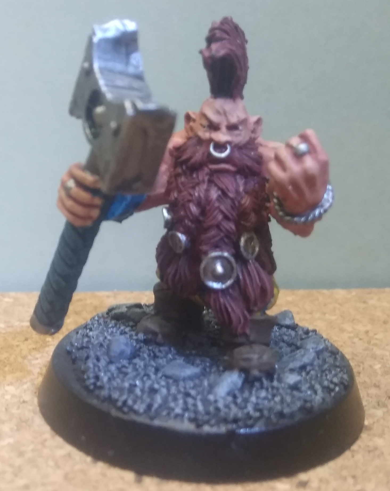

# Pit Fighter Warband

## Heroes
**Helme Haffax**  
Pit King  

**Gaius Cordovan Eslam Galotta**  
Initiate  

**Dimiona von Zorgan**  
Initiate  

**Skrechu**  
Veteran  

**Sulman al'Venish**  
Dwarf Troll Slayer  

## Hired Swords  
**Torxes von Freigeist**  
Bard  

**Liscom von Fasar**  
Pit Fighter  

**Azaril Scharlachkraut**  
Kislev Ranger  

**Darion Paligan**  
Thief  

## Henchmen  
**Unbesiegbare Legion von Yaq~Monnith**  
2 Pursuer  

**Blutige Äxte**  
3 Pursuer  

**Drachengarde**  
1 Pursuer  

**Eisenkralle**  
1 Pursuer  

**Horde von Ghumai-Kal**  
1 Pit Fighter  

**Berserker des Belhalhar**  
1 Pit Fighter  

**Arzuch**  
Ogre Pit Fighter  

