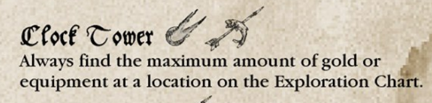
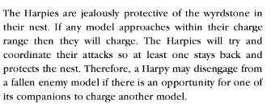

## Initial Warband
**Noble** + Mace (85 + 3 => 88)  
**Engineer** + Crossbow (50 + 25 => 75)  
**2 Troll Slayer** + 2 GW (2x 50 + 2x 15 => 130)  
**3 Beardlings** + 1 Dagger (und 2 Dagger von den Slayer) (3x 25 + 2 => 77)  
**2 Thunderer** + 2 Crossbow (2x 40 + 2x 25 => 130)  
=> 500 GC

## 31.07.22 Das Massaker am Ost-Tor
Ja, das ist so gar nicht gelaufen am letzten Sonntag. Tatsächlich war es ein ziemlich frustrierendes Spiel für mich. Nicht weil ich verloren habe. Das passiert. Erst Recht bei drei Spielern und besonders in Mordheim. Schwamm drüber.  
Auch nicht weil mein Leader in der Post-Game-Sequence gestorben ist. Das war ziemliches Pech, aber da mir die Warband nicht wirklich zusagt (s.u.), hat es nur meine Entscheidung bekräftigt zu resetten.  
Nein, das große Problem für mich war, dass ich im Spiel gefühlt nur genau eine Entscheidung hatte. Gehe ich nach meinem ersten Wyrdstone in die Mitte zum Zweiten, oder laufe ich weg. Ich habe einen Großteil der Züge nur mit Laufen verbracht, da erschien mir der Gedanke jetzt einfach wieder umzukehren und das war dann das Spiel für mich extrem unbefriedigend. Deswegen bin ich in die Mitte gegangen.  
Danach wurden alle meine Aktionen fremdbestimmt: Ich konnte nicht entscheiden, ob ich die Beastmen angreife. Dazu ist die Movement-Diskrepanz zu krass. Ich konnte mich nicht entscheiden, ob ich mich auf einen Shoot-out mit den Skaven einlasse, da ich den mit an Sicherheit grenzender Wahrscheinlichkeit verlieren würde. Meine Bewegung wurde auch komplett von der weit Überlegenen Mobilität der Skaven bestimmt. Das ist für mich wirklich kein ansprechendes Spiel.  
Fazit der Zwerge: Zu wenige Bodies, zu immobil, zu wenig Möglichkeiten auf dem Feld was zu machen. Das war zwar irgendwie vorher klar, aber ich wollte mich Herausfordern. Hat nicht so gut geklappt :)

**Welche neue Warband soll es also sein?**  
Ich wollte definitiv eine stärkere Warband, da ich sowohl Skaven, als auch Beastmen für sehr mächtig halte. Meine erste Idee waren Orks. Die Liste schreibt sich auch schön simpel: Nimm alle Helden und fülle dann großzügig mit Goblins mit Bögen auf. Easy. Allerdings bin ich mir sicher, dass noch eine Warband mit Shooting-Spam den Spielspass nicht erhöhen wird. Der Build fällt also flach. Die nächste Möglichkeit ist der Troll. Der ist fett, regeneriert und verursacht Fear. Super, der Typ. Allerdings kostet er auch so viel wie acht Boys und ist damit gegen die Flut an Ratten einfach die schlechtere Wahl. Bitter aber wahr. Damit bleibt dann noch die unkreative Variante: Boy-Spam. Man kriegt so eine okaye Menge an T4 Bodies. Aber wieder keine Shooting, keine Geschwindigkeit und dafür Animosity. Ich habe wirklich lange hin und her gebaut, aber so richtig überzeugt hat mich nichts davon.  

Also zurück ans Reisbrett. Wenn ich schon nach dem ersten Spiel meine Warband restette, dann sollte ich aus der Not eine Tugend machen: Ich habe perfekte Informationen über die Listen, gegen die ich antrete. Das muss sich doch irgendwie lohnen.  
Fassen wir mal die Opposition zusammen: Sehr mobil, viel Shooting auf der einen und viele T4 Typen auf der anderen Seite. Größter gemeinsamer Nachteil ist vermutlich die niedrige Leadership. Niedrige Leadership? Wait a minute...  

Wer jetzt auch direkt an die lebenden Toten gedacht hat, der hat 100 Punkte. Man bekommt Fear, einen Frontline-Tank gegen Beschuss, Speed mit Vampir und Wölfen und wenn man es schlau anstellt für ein Spiel auch noch den Underdog Bonus. Da lässt sich mit Sicherheit was machen!

## Metagame Undead
**Vampire** + Heavy Armour + Shield (110 + 50 + 5 => 165)  
**Necromancer** (und ein Dagger von einem Dreg) (35)  
**3 Dregs** + 2 GW (und den letzte kriegt einen freien Dagger von seinem Kollegen) (3x 20 + 2x 15 => 90)  
**3 Ghouls** (3x 40 => 120)  
**2 Dire Wolves** (2x 50 => 100)  
=> 510 GC (10 hat Aaron ja spendiert)  
=> 78 Warband Rating (und damit >51 weniger als Aaron)  

## Auswahl Szenario 2  
Als Trostpreis für das letzte Spiel darf ich das Szenario für die zweite Runde auswählen.   
Obwohl die Untoten schon deutlich schneller sind als die Zwerge bin ich noch ziemlich outclassed was Mobilität angeht. Insbesondere im Angesicht von Zentauren/Chaos Dogs auf der einen und infiltrierenden Ratten auf der anderen Seite.  

Mein Plan war also ein Szenario zu wählen, bei dem der Nachteil möglichst wenig ins Gewicht fällt. 
Da nur drei Locations zur Verfügung stehen war die Wahl auch schnell getroffen. Wir ziehen in die Sage's Hall.  

[The Wizard's Mansion](https://github.com/Labernator/Mordheim/blob/master/Return-to-Mordheim/Szenarios/TheWizardsMansion.pdf)

Hier noch die Regeln zu Attacker/Defender:

## 03.09.22 The Wizard's Masion  

**Injuries**  
Keine

**XP**  
 - Isabella: 3 (winning leader, Underdog Survival)   
 - Neferata: 2 (Underdog Survival)  
 - Heterneb: 3 (Kill, Underdog Survival) **+1I**  
 - Giselle: 2 (Underdog Survival) **Skill: Resilient**
 - Bellatash: 3 (Kill, Underdog Survival)  **Skill: Resilient**

**Szenario Loot**  
95GC  

**Exploration**  
5 Wyrdstones  
44 - Free Zombie  
55 - Vague Mordheim Map  

**Verkaufen**  
5 Wyrdstones (80)  
Mordheim Map (10)  
=> 90GC + 95GC Loot =>185GC

**Einkaufen**  
4x Rabbits Foot (40)  
2x Ghoul (80)  
Dire Wolf (50)  
Warlock Hired Sword (15 weil ich Sages Hall gewonnen habe)
=> 185GC also nix angespart. 

**Gedanken**  
Das Szenario hat gezeigt, dass Animals auf meinem Tisch ziemlich schlecht sind. Nur ganz wenig Aufgänge, so dass man sich echt leicht vor ihnen verstecken kann.  
Trotzdem habe ich in noch einen (sehr teuren) Wolf investiert. Das zeigt schon, dass ich im Moment ein bisschen ratlos bin. Mir fehlen gerade Einheiten die relevant Schaden machen können. Speziell an T4 Beastmen. Der Vampir ist super und die Dregs kommen hoffentlich irgendwann da hin. Aber ansonsten hat die Warband nur Wölfe die relevant Stärke haben, da weder Ghoule noch Zombies Waffen benutzen dürfen.  
Also gibt es zähneknirschend halt noch einen Wolf.   
Da ich das letzte Szenario gewonnen habe ist der Warlock zum einen echt günstig, ~~vor allem aber darf ich seine Spells auswählen statt zu randomizen. Das macht ihn viel nützlicher!~~ Das ist nicht wie der Reward funktioniert...  

**Warband**  
Vampire: Dagger, HA, Shield, Rabbits Foot  
Necro: 2x Dagger, Rabbits Foot  
Heterneb: 2x Dagger   
Giselle: GW, Rabbits Foot  
Bellatash: GW, Rabbits Foot  
Warlock: Staff  
5 Ghoule, 3 Wölfe, 1 Tschumbie  

## Auswahl Szenario 3  
Mein Warbandrating ist trotz deutlichem Power Spike immer noch am niedrigsten, also habe ich nochmal die Ehre.  
Zur Auswahl stehen "Monster Hunt" und "The Shadowlords Doorstep" die beide sehr ähnlich sind. Bei beiden muss ein riesen Monster in der Mitte besiegt werden. Und dazu ist meine Warband viel zu schwach. Die scheiden folglich beide aus. "Defend the Find" ist ein Attacker/Defender-Szenario, bei dem ich Laber für wenig Profit in die Pfanne hauen könnte. Klingt unprofitabel. Bleibt also:  

[Happy Harpy Hunting Ground](https://github.com/Labernator/Mordheim/blob/master/Return-to-Mordheim/Szenarios/HappyHarpyHuntingGround.pdf)  

Der Gewinner erhält D3 extra Wyrdstones, dauerhaft eine bessere Exploration Phase und den Loot aus dem Harpien-Nest. High Stakes also :)  
Für das Verhalten der Harpien müssen wir uns noch was ausdenken:  

Mein Vorschlag wäre, dass sie alles in 15" chargen (also eine 3+ brauchen um den Charge zu vollenden). Wenn mehrere Modelle in Range sind chargen sie ein zufälliges. Die Harpien chargen nie ein Modell gemeinsam (?). Ansonsten bleiben sie außer Line of Sight in ihrem Nest.  
Was meint ihr?

## 25.09.22 One Harpy to kill them all  
Oh boy, diese Kampagne will mich wirklich testen. Was ist passiert? Mein schöner 170+ Punkte Vampir, der klare Star meiner Warband wird von zwei Sling-Crits direkt ooA befördert. Ohne im ganzen Spiel auch nur einen seiner 3+ Armour Saves machen zu dürfen. Das ist schlecht. Denn wie schon oben beschrieben hat meine Warband ohne ihn ein Damage Problem. Trotzdem schaffe ich es mit ein paar Suicide-Charges meiner GW-Dregs uns Labers Hilfe Aaron unter sein Rout Limit zu schlagen. Und Laber selbst wurde heftig genug von den Harpien angegangen, dass er auch routen muss.  
Jetzt heißt es also: Meine gesamte Warband gegen die letzte verbleibende Harpie. Ich stelle alle Minis und renne dann einen Ghoul vor. Dadurch allerdings, dass jede Nicht-Vampir höchstens WS3 hat, haben die Harpien einen ziemlich gute Chance auf die Drop-Attack gegen die man einfach nichts machen kann. Es kommt wie es kommen muss: Der erste Ghoul wird gedroppt und gestunned. Also alle anderen Ghoule mit vor um den Killing-Blow unwahrscheinlicher zu machen. Der nächste Harpien-Angriff droppt zwar nicht, dafür crittet er den Ghoul einfach direkt ooA. Und ich faile meinen ersten Rout Test. Schade Schololade.  
In der Post-Game-Sequence rolle ich dann Snake Eyes für die Injuries meines Vampirs und damit sind mir in drei Spielen zwei Leader weggestorben. Mordheim präsentiert sich mir auf jeden Fall von seiner lethalen Seite diesmal.  
Da (wie schon oben erwähnt) die Warband ohne den Vampir nicht funktioniert, fange ich also von vorne an. Nochmal. Diesmal wurde allerdings auch Aaron von den Injury-Rolls gut zerlegt, so dass wir vielleicht einfach die komplette Kampagne resetten.  
Better luck next time, I guess.

## Puny Humans
Ich würde ja gerne behaupten, dass viel Strategie und taktische Finesse in die Auswahl meiner nächsten Warband geflossen ist. Leider wäre das nicht wirklich korrekt. Ich habe noch einen Schwung geprimter Menschen in meinem Backlog und eine neue Warband ist doch ein guter Motivator.   
Und da meine hoch taktischen Entscheidungen bisher auch nicht viel Früchte getragen haben, werden es jetzt Menschen. Für Averlander habe ich mich entschieden, weil die am interessantesten aussahen.  

**Captain** + Bow (und ein Dagger von Mountainguard) (60 + 10 => 70)  
**Sergeant** + 2 Maces (35 + 2x 3 => 41)  
**2 Bergjaeger** + 2 Bows (und zwei Dagger von Youngblood & Sergeant) (2x 35 + 2x 10 => 90)  
**Youngblood** + GW (15 + 15 => 30)  
**4 Mountainguard** + 8 Maces (4x 30 + 8x 3 => 144)  
**3 Halflings Scouts** + 3 Bows (und drei Dagger von der Mountainguard) (3x 20 + 3x 10 => 90)  
**Pit Fighter Hired Sword** (30)  

=> 495 GC   
=> 118 Warband Rating 

## Mighty Orks
Ok, da ich nicht weiß wann ich die nächste Gelegenheit bekomme muss ich vielleicht in dieser Kampagne noch was ausprobieren. For science. Wie gut sind Orks wirklich.  
In meinem Kopf sind sie ganz klar eine Top Warband. Aber das habe ich von den Zwergen auch mal gedacht...  

Der Vergleich mit den Skaven: 
 - Short Bows statt Slings (bei uns kein Thema)
 - Weniger Shooty Guys (weil Goblins zahlenmäßig beschränkt sind)
 - Schlechtere XP auf den Helden
 - Animosity
 - Weniger Initiative
 - Weniger Movement
 - Zwei Helden weniger

Alles klar, Orks sind schlechter als Sklaven. Das sagt jetzt erstmal nicht viel, welche Warband ist das nicht ;) 

**Boss** + Halberd (80 + 10 => 90)  
**Shaman** (mit Dagger von Boss) (40)  
**2 Big 'Uns** + 2 Dagger (2x 40 + 2x 2 => 84)  
**1 Orc Boy** + Dagger (25 + 2 => 27)  
**9 Goblin Warrior** + 9 Short Bows + 9 Dagger (9x 15 + 9x 5 + 9x 2 => 198)  
**1 Goblin Warrior** + Squig Prodder (15 + 15 => 30)  
**2 Cave Squigs** (2x 15 => 30)  

=> 499 GC   
=> 145 Warband Rating 
