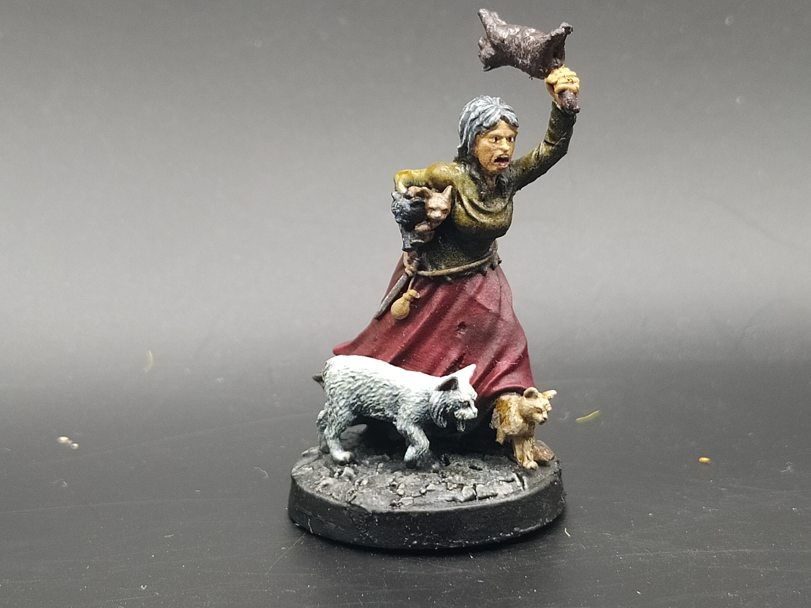

# Scourge of Sylvania (Unead Warband)  
## Spiele 
 - [Initial Warband](Campaign_Log.md#initial-warband)
 - [Reset](Campaign_Log.md#310722-das-massaker-am-ost-tor)
 - [Metagame Undead](Campaign_Log.md#metagame-undead)
 - [Auswahl Szenario 2](Campaign_Log.md#auswahl-szenario-2) 
 - [Sage's Hall](Campaign_Log.md#030922-the-wizards-masion) 
 - [Auswahl Szenario 3](Campaign_Log.md#auswahl-szenario-3) 

## Warband
**Isabella von Carstein**  
Vampire  

**Neferata**  
Necromancer  

**Heterneb of ancient Lahmia**  
Dreg  

**Giselle of Marienburg**  
Dreg  

**Bellatash of Tilea**  
Dreg  

**Corpse Eater**  
3 Ghouls  

**Night Hunter**  
2 Dire Wolves  

