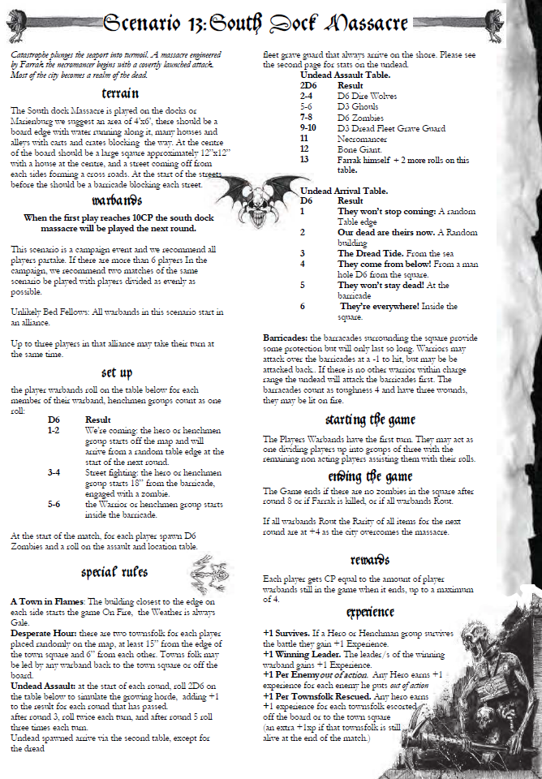
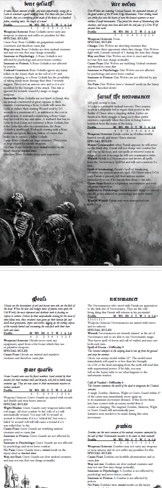

**Game Day:** 04.06.2024  
**Szenario:** South Dock Massacre  
**Wetter:** Gale (was auch immer das bedeutet?!?)

## House Rules
 - Es gelten nur die XP Regeln aus dem Szenario mit folgender Ergänzung: 2XP für Teilnahme, zusätzlich D3 XP für Bone Giant oder Farrak ooA
 - Für das Setup des Szenarios gelten alle Henchmen eines Typs als "Henchmen Group" und deployen zusammen.

## Warband rating
- Black Death: 568
- The Lanisters: 710 (der Blood Stone pusht das Rating ganz schön...)
- Saurus: 547

## Setup
**Stefan**  
 - Jarl: off the Board
 - Berserker: off the Board
 - Wulfen: im Square
 - 2 Bondsmen: im Square
 - Mage: in the street
 - Marksmen: in the street
 - Hunter: in the street
 - Wölfe: in the street

**Philipp**
- Rerkit Poisonfur (Assassine Adept) - Street Fighting
- Nelachitt Verminbite (Eshin sorcerer) - Barricade
- Quaknaw Poisongash (Black Skaven)  - Street Fighting    
- Swilik Gutterbane (Black Skaven) - Barricade
- Rotrek Doommange (Nightrunner)  - Random Edge
- Snilik Blackshard (Nightrunner) - Barricade
- Skitrit Cankernip (Verminkin) - Barricade
- Iklik Blackfilth (Verminkin) - Street Fighting
- Rachtilik Bonefur (Verminkin) - Barricade     
- Tholk Bloodpest (Verminkin) - Street Fighting   
- Ratchkit Greyclaw (Verminkin) - Random Edge
- Paskreet Fleshfiend (Verminkin) - Random Edge
- Skyre Stormnip (Verminkin) - Random Edge

**Marius**
- Haku (Skink Priest) - Street Fighting
- Gojira (Totem Warrior) - Random Edge
- Spots (Skink Great Crest) - Street Fighting     
- Spike (Skink Great Crest) - Barricade
- Pendragon (Kroxigor) - Street Fighting 
- Tehanu (Saurus Brave)  - Barricade 
- Mojo (Skink Brave) - Street Fighting

**Opposition**  
 - 16 Zombies auf dem Feld
 - 4 Zombies an einem random Gebäude
 - 3 Ghoule an der Barrikade
 - 1 Dire Wolf an der Barrikade

## XP
**Philipp**
- swilik +2exp (Survive + 1Kill)
- quaknaw +2exp (Survive + 1Kill)
- nelachitt +2 exp (Survive + 1Kill)
- rotrek +1exp (Survive + 1Kill)
- Skyre + 1exp
- Snilik + 1 Exp
- Skitrit + 1Exp
- Iklik + 1Exp
- Paskreet + 1Exp

**Stefan**
 - Wulfen +7 (teilnehmen + 5 kills)
 - Berserker +3 (teilnehmen + 1 kill)
 - Jarl +3 (teilnehmen + 1 kill)
 - Bondsman 1 +4 (teilnehmen + rescued hostage)
 - Rest +2 fürs teilnehmen

## Injuries
**Philipp**
- Kilik Emfeebled -1T

- **Stefan**  
- Mage -1M

## Income
**Philipp** 
- 2 Treasures + 2 Shards + 40gc + 8gc (44) + 1 Lucky Charm
- 3 Treasures + 1 Shard + 40gc + (55) 1 Rabbits Foot

## Postgame Sequence
**Philipp** 

**Stefan**
 - Chef: Bone Garden: +8GC
 - Berserker: Bordello: 1XP (erstes Mal), -5GC
 - Wulfen: Bone Garden: -1I für das nächste Spiel...
 - Mage: Gambling Den: -12GC
 - 2 Bondsmen: Abattoir: 2 Slaves, Ghoule Nest für Joffrey, Blood Stone, -20GC
 - Marksman: Kein Bloodpact, Upkeep -15GC
 - Einkommen: Verkaufe 4 Treasuren (und behalte 1 Wyrdstone für schlechte Zeiten) für 50GC. 40GC fixes Einkommen. 9GC vom Dockside Warehouse. 1GC noch von der Warband Creation => 100GC
 - Ausgaben: Netto aus den Aktionen der Helden: -44GC. Bleiben noch 56GC übrig.
 - Trading: Kaufe einen neuen Wolf (-15GC). Gehen also noch 41GC in War Chest.
 - Ausrüsten: Chef kriegt den Blood Stone, Wulfen kriegt den Rabbits Foot.
 - Experience: Mage kriegt den "Mind Focus" Skill für 9XP (+20 Warband Rating). Wulfen kriegt +1T für 9XP (+20 Warband Rating)

## CP
**Stefan**
 - +4 fürs Dabeisein
