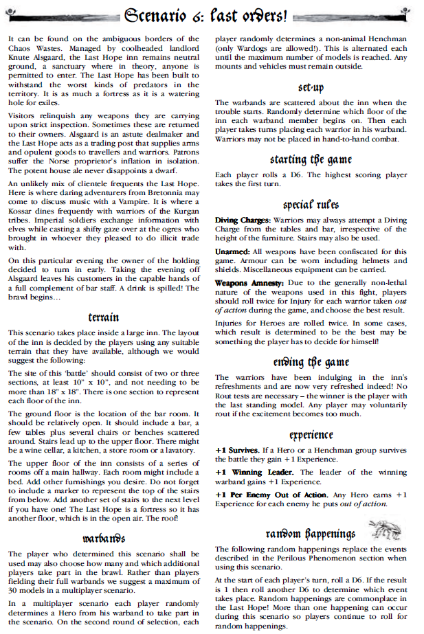
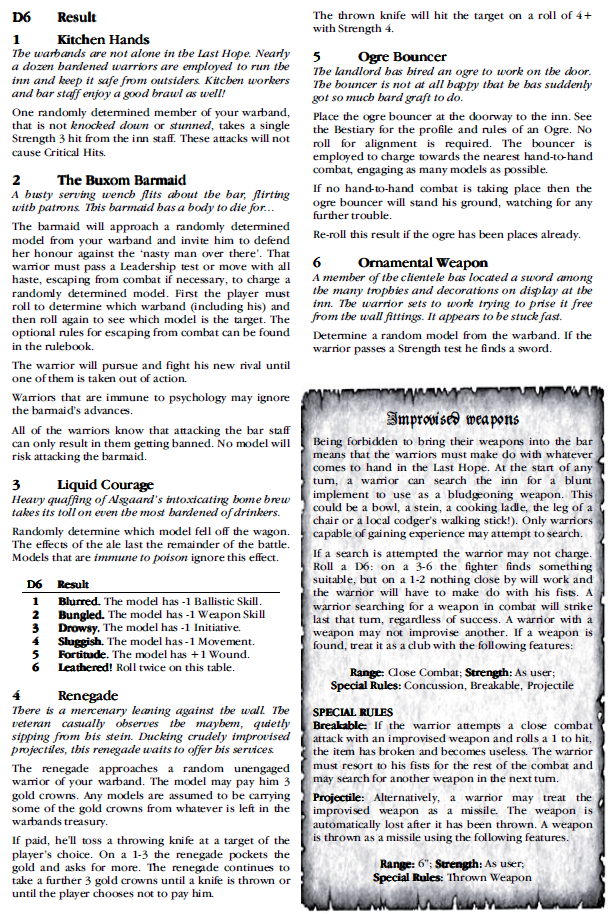

**Game Day:** 24.06.2024  
**Szenario:** Last Orders  
**Wetter:** Was auch immer, wir sind drinnen!

## House Rules
 - Der "Pit Fighter" Skill gibt auch unbewaffnet +1A
 - Ein Charge gibt auch unbewaffnet +1A
 - Frenzy gibt unbewaffnet keine extra Attacken

## Warband rating
- The Lanisters: 836  (jetzt neu mit 250 Punkten an Blood Stones)
- Saurus: 547

## Setup
**Stefan**  
**Erdgeschoss**  
 - Jarl
 - Wulfen
 - Joffrey
 - Myrcella
 - Marksman

**Obergeschoss**
 - Berserker
 - Mage
 - Alle Hunter
 

## Kills
 - Hunter 3 tötet Tehamu
 - Wulfen killt Saurus Held
 - Marksman killt Ghoul
 - Willem killt Saurus

## XP
 - Jarl - 5xp (kill, winning leader, take part)
 - Willem - 4xp (kill, take part)
 - Zerker - 3xp (serious injury, take part)
 - Wulfen - 5xp (hero kill, take part)
 - Marksman - 4xp (kill, take part)
 - Rest 2XP fürs dabei sein

## Injuries
 - Tehamu - Out Cold
 - Gojira - Head Injury
 - Dodo - captured - 9gc

## Income
**Stefan**  
 - Fixes Income: 40GC
 - Exploration: 6 Treasures
 - 33: Hostage
 - 66: 2 Clubs, 2 Helmets, Corpse, 30 GC
 - Warehouse: 8GC

**Marius**  

## CP
**Stefan**  
 - Dabei sein: 4
 - Gewinnen: 2
 - 4 Hostages (Skink, 33, 2x Metzger): 1

**Marius**  

## Postgame Sequence 
**Stefan**  
 - Jarl: Dream Parlour: +1XP, Blissed next Game => -10GC
 - Berserker: Tannery (11111): Enchanted Skins => -10GC
 - Wulfen: Cartographer: Muss einen Würfel weglegen nächste Exploration Phase, -15GC
 - Mage: Looking for Rare Items (7): Rabbits Foot => -10GC
 - Joffrey: Abattoir: Ghoule Nest (again), -20GC
 - Myrcella: Abattoir: + Black Dust, -20GC
 - Marksman: Kein Blood Pact, -15GC Upkeep
 - Verkaufe Black Dust (+13GC), 5 Treasures (+60GC) => 73GC
 - Einkommen: Stash (145), Income (78), Verkaufen (70), Post Game (0), Versklavte Ratte (9) => 302GC
 - Ausgaben: Post Game (100), kaufe einen neuen Warrior (25), Mutation: Scaly Skin (60), Mutation: Hulking Brute (50), Light Armour (20) => 255
 - Umequippen: Mage kriegt einen Rabbits Foot, Chef kriegt Helm, Halfling Cookbook & Unholy Relic, Berserker kriegt Helm, Rabbits Foot & Light Armour, die beiden Bondsmen erhalten die Clubs und der neue Warrior kriegt Joffreys Dagger
 - War Chest: 47 GC, 1 Wyrdstone, 9 Hostages, 1 Corpse, Morning Star
 - Experience Heroes: Jarl kriegt den "Mutation: Scaly Skin" Skill für 9XP (+20 Warband Rating + 60 Kosten => 80), +1W für 10XP (+25), +1T für 9XP (+20). Wulfen kriegt den "Mutation: Hulking Brute" Skill für 9XP (+20 Warband Rating + 50 Kosten => 70) für 9XP. Der Berserker kriegt +1T & +1W für 19XP (+45 Rating), Marksman kriegt +1BS für 6XP (+10 Rating)
 - Experience Henchmen: Jeder der Hunter hat 6XP und kriegt einen Advance: +1I, +1S, +1BS

**Marius**  
