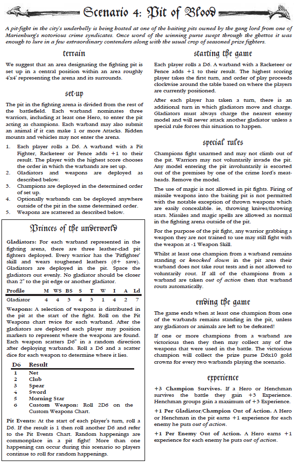
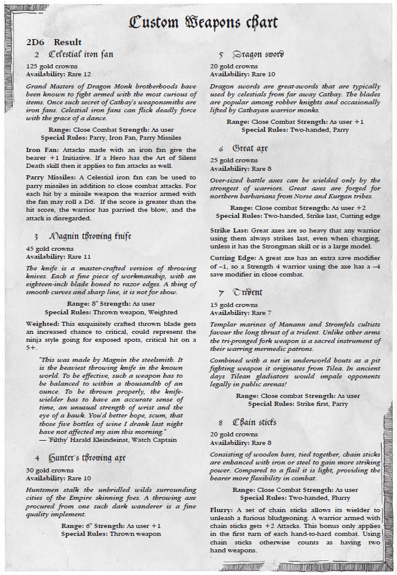
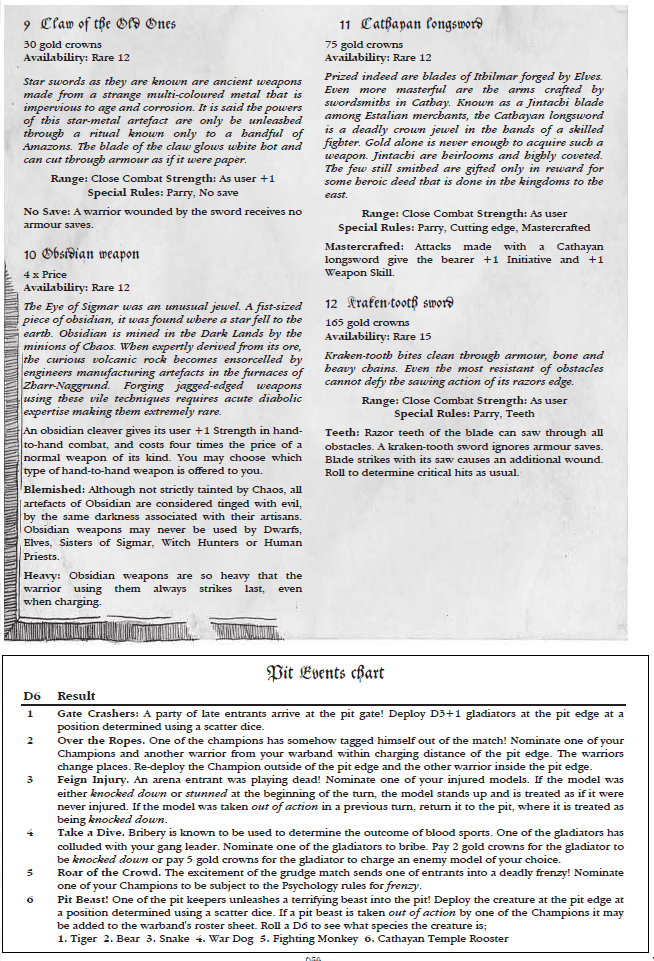

**Game Day:** 18.06.2024  
**Szenario:** Pit of Blood  
**Wetter:** Was auch immer, wir sind in einer Arena

## House Rules
 - Heroes werden abwechselnd deloyed
 - In der Arena darf nur ein einzelner Held in einer Runde aktiviert werden.
 - Rüstungen und weiteres Equipment sind ok in der Arena
 - Neue simple Action "Pick up Weapon". Nimmt eine Waffe innerhalb von 1" auf.

## Warband rating
- The Lanisters: 836  (jetzt neu mit 250 Punkten an Blood Stones)
- Dirty Rats: 547

## Weapons
 - 2 Nets
 - Spear
 - Morning Star

## Special Rules
 - Stefan muss am Anfang jeder Runde einen D6 rollen. Bei einer 1 wird Joffrey von D3 Ghoulen attackiert.

## Injuries
**Stefan**  
 - Wulfen und ein Wolf, beide full Recovery
 - Mein Chef versklavt eine Ratte die für 9GC an Philipp zurück verkauft wird

**Philipp**
- Skitrit captured (freigekauft für 9gc)
- Rotrek out cold
- Iklik out cold

## Reward
Stefan gewinnt und bekommt D6x10GC => 60 (nice) und die Waffen (2 Nets, Spear, Morning Star)

## XP
**Stefan**  
 - Chef: +15 (4x Seriuosly Injured, 3x Kill, Surviving Champion, Take Part)
 - Berserker: +13 (4x Kill, Surviving Champion, Take Part)
 - Wulfen +4 (1x Kill, Take Part)
 - Rest +2 fürs Dabei sein

**Philipp**
- Rotrek 4 Exp (TP + Kill)
- Iklik 4 Exp (TP + Kill)
- Rest + 2 Exp

## Income
**Stefan**
 - Fixes Income: 40GC
 - Exploration: 3 Treasures
 - 22: 2 Nets & 4 GC
 - 11: Myrcella stirbt
 - Warehouse: 8GC

**Philipp**
- Fixes Income: 20 gc
- Exploration: 3  Treasures (alle Wyrdstone - siehe Plot)

## CP
**Stefan**
 - Dabei sein: 4
 - Gewinnen: 2
 - 2 Hostages (Ratte, Metzger): 0

**Philipp**
- Dabei sein 4 CP
- 2 CP für tainted treasures

## Postgame Sequence 
**Stefan**
 - Chef: Looking for Rare Items (8): Halfling Cookbook (30 + 3D6GC) => -38GC
 - Berserker: Looking for Rare Items (8): Rabbits Foot => -10GC
 - Wulfen: Fighting Pit: +2XP, +50GC
 - Mage: Looking for Rare Items (8): Unholy Relic (15 + 3D6GC) => -24GC
 - Joffrey: Abattoir: +Mandrake Root, -20GC
 - Myrcella: stirbt in den Exploration, darf also keine coolen Dinge machen und wird nachgebaut, -15GC
 - Marksman: Kein Blood Pact, -15GC Upkeep
 - Verkaufe 4 Nets (+12GC), 1 Spear (+5GC), Mandrake Root (+13GC), 3 Treasures (+40GC) => 70GC
 - Einkommen: Stash (41), Szenario (60), Income (52), Verkaufen (70), Post Game (50), Versklavte Ratte (9) => 282GC
 - Ausgaben: Post Game (122), kaufe einen neuen Wolf (15) => 137
 - War Chest: 145 GC, 1 Wyrdstone, 6 Hostages, Morning Star, Rabbits Foot, Halfling Cookbook, Unholy Relic
 - Bei 20 CP bekomme ich die Tannery (11111). Mein Chef bekommt ein random Grace of Shornaal: Agile. Das macht irgendwie nichts.
