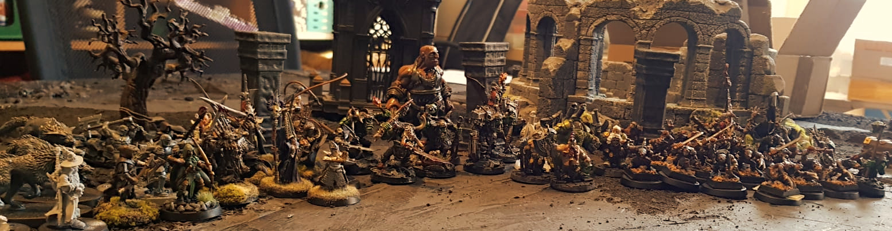

## Warbands

* [Stefan (CZ)](/Stefan/Diary.md): [Clan Eshin](/Stefan/The%20Silent%20Death%20-%20Clan%20Eshin.md) (Legends: [The Great Forest](/Stefan/Archiv/Forest-Walkers.md))
* Marius (Laber): [Norse](/Marius/Norse%20pack)
* [Kai (klaute) diary](/kai/kai-orks_diary.md): [Black Orks](/kai/kai-warband.md) (Legends: [Orks mostly epic and Goblins](/kai/old/orks_1/kai-orks_mostly_epic_and_goblins.md), [Orks mostly epic](/kai/old/orks_2/kai-orks_mostly_epic.md))
* [Aaron (f00860)](/aaron-f00860/diary.md): [Dwarf Rangers #2](/aaron-f00860/warband-phoenix.md) (Legends: [The Smashing Skull](/aaron-f00860/warband-the-smashing-skull.md), [Twilight of the Dead](/aaron-f00860/warband-twilight-of-the-dead.md))
* Fabian (Gary): [Dary Elves](/Fabian/Dark%20Elves.md)

# Absprachen & Anpassungen am Regelwerk

* [Houserules](/Dokumente/Houserules.md)
* [Multiplayer Ideen](/Ideensammlung%20Multiplayer.md)
* [Battlelog](/Kampagnen%20Battle%20Log.md)

# Termine

* Sonntag, 14.10.2018 11:00 Uhr bei Aaron
* Samstag, 03.11.2018 10:00 Uhr bei Stefan
* Sonntag, 18.11.2018 10:00 Uhr bei Stefan
* Samstag, 15.12.2018 10:00 Uhr bei Stefan
* Sonntag, 20.01.2019 10:00 Uhr bei Kai
* Samstag, 09.02.2019
* Samstag, 16.03.2019  
