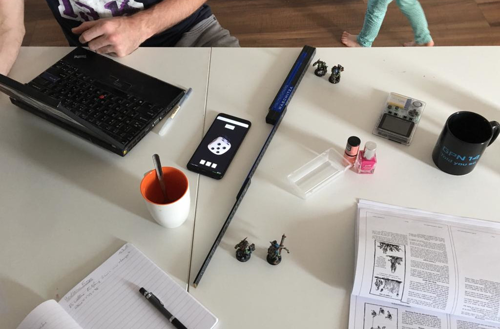
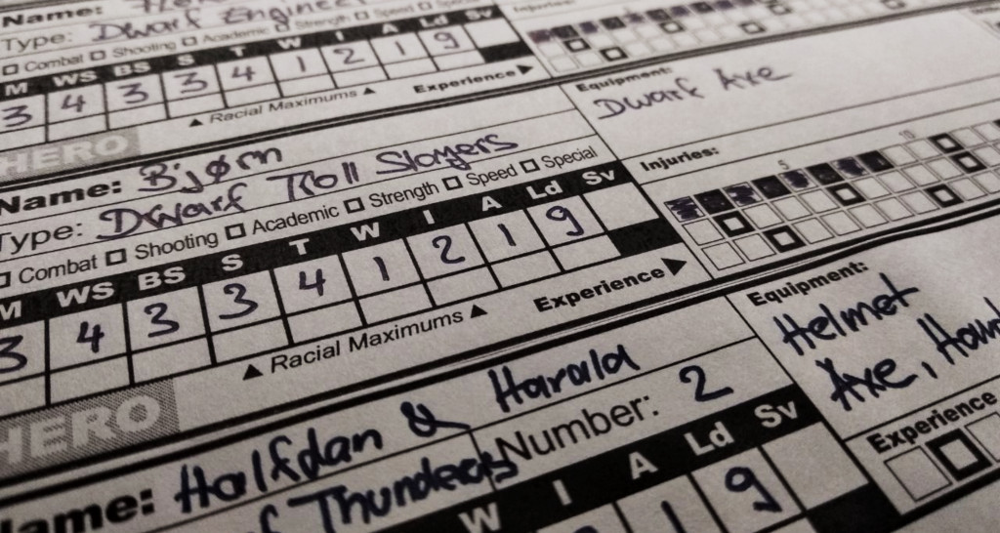
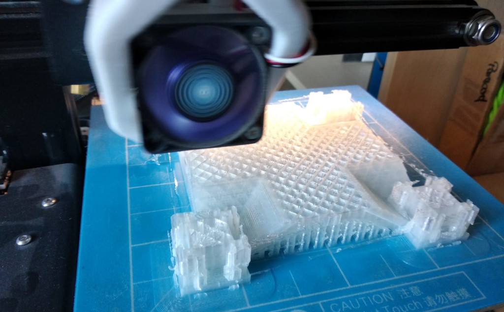
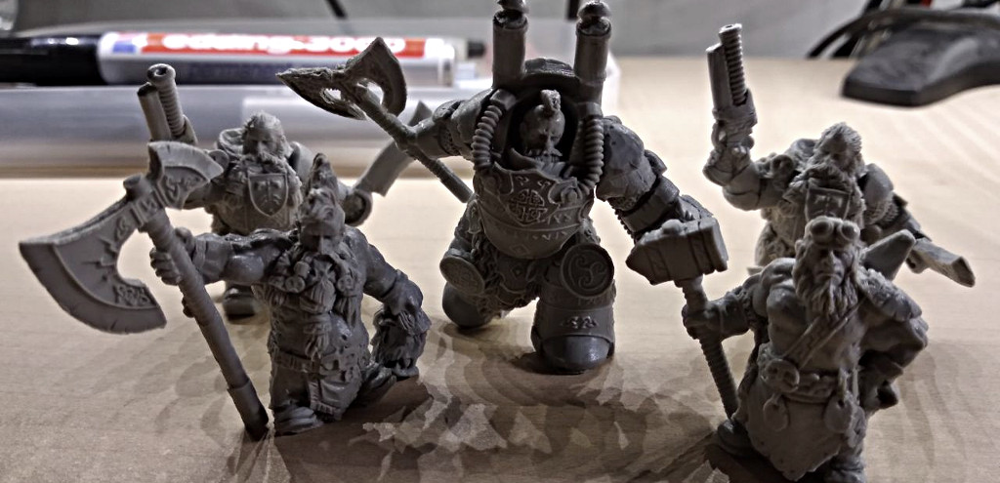
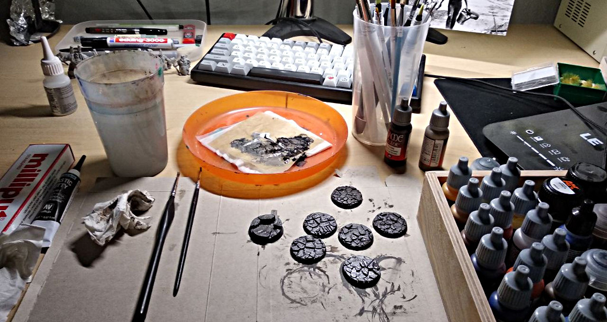

## Wahl der Warband

**2018/08/05**: Ich bin mir immer noch nicht ganz sicher was für eine Warband ich
wählen soll. Muss mich denke ich da noch etwas mehr einlesen und etwas die
Minis beäugen -- soll mir ja auch optisch gefallen :) Aktuell tendiere ich zu
den Shadow Warriors oder den Ostlanders.

**2018/08/17**: Nach langem hin und her habe ich mich für die Dwarf Treasure Hunters
entschieden. Ich denke das passt gut, vor allem in Kombination mit dem Engineer
lässt sich eine taktisch gute Warband aufstellen. Ich habe dazu schon etwas
angefangen die GC in einem excel sheet zu vergeben, um so die Warband besser
planen zu können. Für die Minis bin ich auf http://sciborminiatures.com/ fündig
geworden, welche bezahlbar sind und gut aussehen. Nächster Schritt: Die Warband
komplett planen, dann kann ich die Minis bestellen.

**2018/08/21**: Ich hab mal auf thingiverse ein paar Bases rausgesucht in 32mm
Größe. Zudem muss ich meine excel noch etwas verfeinern (siehe Kai) und die
Tips einfließen lassen die mir gegeben wurden.

## Erste Versuche die Spielmechanik zu verstehen

**2018/09/16**: Lange nichts passiert, war mit vielen anderen Dingen beschäftigt.
Kai und ich haben uns heute mal zur Lagebesprechung und Feinjustierung
unserer Warbands zusammengesetzt. Nach ausgiebigen Regel-Klärungen und
Optimierung der einzelnen Einheiten haben wir ein erstes Testspiel mit jeweils
zwei Einheiten gemacht, um die Spielmechanik besser zu verstehen. Das Regelwerk
ist doch komplexer als angenommen. Zudem wirft es einige Fragen auf.
Fernkampfwaffen sind nicht verkehrt, ebenso die Spezialeigenschaften der
gewählten Rasse zuszunutzen. Irgend eine Art der Verteidigung (Schild,
Panzerung, Helm, ...) ist auch essenziell. In zwei Wochen versuchen wir ein
richtiges Spiel mit der kompletten Warband. Bis dahin: Minis bestellen und
bemalen.

## Minis

**2018/09/17**: Die Minis sind bestellt. Jetzt heißt es, warten. In der
Zwischenzeit werde ich die Warband Details zusammenschreiben und evtl.
auch einen Fluff schreiben.

**2018/09/26**: Weiter warten auf die Minis. Es wurde berichtet, dass nach 11 Tagen
mit einer Lieferung zu rechnen ist. In der Bestätigungs-Mail stand was von
zwei Wochen. Also müsste es bald soweit sein. Bis dahin habe ich noch genug
mit dem Regelwerk und meiner Warband zu tun.

## The Smashing Skull

**2018/09/27**: Die Warband ist fürs Erste mal fertig geplant. Ich habe keinerlei
Ahnung, ob das so sinnvoll ist oder total nach hinten los geht. Das Warband
Rating ist im Vergleich zu den anderen relativ niedrig. Entweder ich hab falsch
gerechnet, "das gehört eben so", oder ich habe einen grundlegenden Fehler
in meiner Warband-Planung. Das wird sich aber denke ich dann beim Spielen zeigen.
Am Samstag versuchen Kai und ich noch einmal ein Probespiel. Die Zwerge haben
einige Special Skills und Rules, die ich mir noch im Detail einverleiben
muss. Ebenso die Spielmechanik und die Wunsch-Skills/Equips.

**2018/09/29**: Kai und ich hatten nochmal eine Runde zusammen gespielt. Diese
Mal lief es etwas besser und wir konnten sogar das Barracks Scenario komplett
zuende spielen. Die After-Match-Sequence haben wir aber nicht komplett vollzogen.
Beim nächsten Mal dann. Mussten wieder viel nachschlagen.

## Terrain

**2018/09/30**: So lange ich auf die Minis warte, haben ich begonnen etwas
Gelände mit dem 3D-Drucker auszudrucken. Zuerst [ein paar Säulen](https://www.thingiverse.com/thing:3001036),
die waren recht schnell fertig. Dann eine [art Kathedrale](https://www.thingiverse.com/thing:1875150),
die aber aus relativ vielen Einzelteilen besteht. Da werde ich ein paar Tage
drucken. Dann noch [ein paar Fässer](https://www.thingiverse.com/thing:32016) und
für das Barracks Scenario habe ich [eine Schatzkiste](https://www.thingiverse.com/thing:3131013) so
umgebaut, dass wir sie verwenden können. Die drucken ich dann auch noch 20 mal
aus. Was ich auch schon mal drucken kann sind 32mm Bases für meine Zwerge. Ach
ja, und eine FantasyWelt.de Bestellung musste auch noch raus, mein Primer ist
leer.

**2018/10/01**: Endlich sind die Minis da :) Nun kann es losgehen. Habe eben
noch ein paar kleine Änderungen an der Warband gemacht, da hab ich mich wohl
verrechnet.

**2018/10/02**: Heute hab ich die Minis zusammengeklebt und von überstehenden
Resin-Resten befreit. Sie sehen wirklich gut aus, freue mich schon sie
anzumalen. Leider ist die Fantasywelt.de-Bestellung noch nicht da, so dass ich
hier noch warten muss. Aufgespießt habe ich sie allerdings schon mal.

**2018/10/04**: Da mir etwas die Zeit fehlt und ich noch einiges an Gelände
anmalen muss, habe ich mich entschlossen das Airbrush-Equipment rauszuholen. Das
macht das Füllen von Flächen erheblich einfacher, vor allem bei den 20
Schatzkisten und der Kathedrale. Leider hatte ich nur die Grundfarben als
"air"-Variante, so musste ich mir braun und grau selbst mischen.

Die Bases für die Minis habe ich mir auch ausgedruckt. Das spart mir etwas
Arbeit beim Gestalten der selbigen. Diese hab ich dann auch gleich mal mit einem
braun/grauen Grundton angemalt. Mit einem Wash und etwas drybrushing sieht das
denke ich schon einigermaßen aus. Den Rest mache ich dann, wenn die Minis
aufgeklebt sind. Als nächstes geht es dann an die Feinarbeiten und die Minis.

