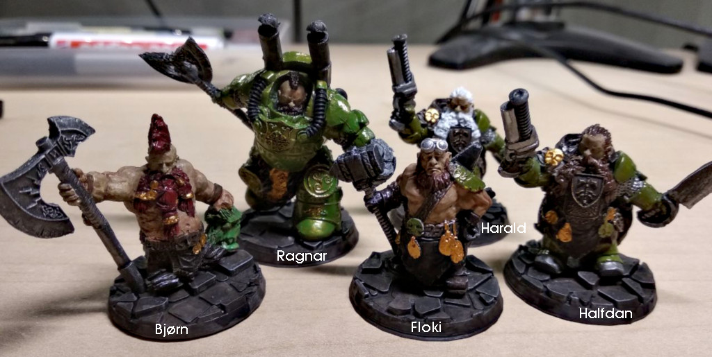

# The Smashing Skull (Dwarf Treasure Hunters)

## Ragnar & Floki

Der Dreck kratzte im Hals und knirschte zwischen den Zähnen. Der Staub hing so
dicht in der Luft, dass man nichts sehen konnte. Ragnar branten die Augen und
das linke Bein fühlte sich nicht gut an. Als die Decke im engen Stollen
herunterbrach, löste sich ein Findling und klemmte sein Bein ein. Er versuchte
aufzustehen, aber es war nicht möglich.

Der Staub legte sich langsam. Der Schein der Petroleum-Lampe offenbarte Ragnar
das Ausmaß. Einige Stützbalken waren vom Druck der Decke zerbarsten. Schutt und
Geröll versperrten ihm den Weg nach oben. Mit einer langen Metallschaufel, die er
als Hebel verwendete, wuchtete er stöhnend den großen Stein etwas zur Seite, um
sein Bein herauszusiehen. Es war nicht gebrochen, aber blutete stark. Er band
sich das Bein mit einem Lederriemen ab, das verlangsamte die Blutung etwas.

Er saß in der Falle, konnte nicht zurück und auch nicht weiter nach vorn. Er
rief, aber keiner konnte ihn hören, er war zu tief unter der Erde. Es vergingen
Stunden. Ragnar hatte sich schon aufgegeben, als er eine leichte Vibration im Boden
spürte. Es war ein Schaben und rumpeln zu hören, das immer lauter wurde. Er
richtete sich auf und versuchte herauszufinden was es war. Das Schaben wurde
lauter und lauter, fast schon unerträglich. Von der Decke rieselte es Erde und
kleine Steinchen. Der Stollenabschnitt, ihn dem er sich befand, drohte nun
ebenfalls einzustürtzen. Die Balken ächtzten, doch aus dem ganzen Lärm hörte er
plötzlich eine sehr vertraute Stimme; Es war Floki. "Weg da, ich komme jetzt
rein." rief er. Ragnar verstand nicht, aber ging vorsichtshalber so weit in den
Stollen hinein wie es ihm möglich war. Mit einem lauten Kreischen dran ein
überdimensionaler Bohrer durch die Decke und landete Ragnar vor den Füßen.
Frische Luft und Tageslicht dran in den Stollen. Ragnar blinzelte durch das eben
gebohrte Loch nach oben und erkannte Floki mit einem breiten Grinsen. "Den wollte
ich schon immer mal ausprobieren." Kicherte er in seinen Bart hinein.

Die Freundschaft zwischen Ragnar und Floki wuchs seit diesem Tag weiter und sie
halfen sich gegenseitig immer wieder in schwierigen Situationen.

## Bjørn

Brørn war hungrig und nass vom Regen. Er lief seit Tagen umher, aber fand keine
Rast. Er war zum Einzelkämpfer geworden, da er sich aus Sicht der anderen oft
seltsam verhielt. Er war nicht schüchtern und hatte nie Angst vor seinen
Gegnern. Doch das machte vielen unbehangen, wenn sie ihn seiner Nähe waren. Er
sprach nicht viel und war die meiste Zeit in sich gekehrt. Im Kampf wiederum
war er unbarmherzig und brutal. Er schnitt seinem Gegner ohne zu zögern und
ohne einen Anschein von Emmotion die Hauptschlagader durch. Er hatte einen sehr
ausgeprägten Sinn für Gerechtigkeit und ließ diesem auch drastische Taten
folgen, wenn er der Meinung war, dass eine Ungerechtigkeit im Gange war.

Sein Weg endete an einem kleinen Dorf namens Hedeby. Er hielt vor dem ersten
Haus inne. Er war sich nicht sicher, ob er bleiben oder umkehren sollte. Als er
sich gerade umgedreht hatte und wieder aufbrechen wollte, rief ihm jemand zu. "Hey
fremder, komm rein, es regnet.". Es war Ragnar. Brørn blickte zu ihm uns sagte:
"Ich bin kein guter Zwerg. Ich liege meistens falsch.". "Das macht nichts, dafür
liege ich meistens richtig." erwiederte Ragnar.

Am warmen Feuer trocknete er wortlos seine Kleidung und aß Suppe mit Brot.
Ragnars Frau blickte Ragnar ängstlich in die Augen, doch er nickte ihr nur zu.
Ragnar spürte, dass er Bjørn vertrauen konnte.

## Halfdan & Harald

Ragnar hatte schon lange kein Wyrdstone mehr in der Erde gefunden. Er kannte sich
hervorragend im Lesen von Gesteinsschichten aus und erkannte die Anzeichen für
Edelmetalle in der Erde an kleinen Details die die meisten übersahen. Die
Vorkommen in seinem Bergstollen waren erschöpft, das musste auch er einsehen.
Doch die Gier nach Wyrdstone war groß, er war ein Treasure Hunter, daran war
kein Zweifel.

Bjørn erzählte beiläufig, dass es in Mordheim viele zurückgelassene Schätze
gäbe. Zu viele um sie zu tragen. In Mordheim war Ragnar einst als kleiner Junge
gewesen. Es war eine prächtige Stadt, bevor der Kommet einschlug. Seitdem war
er nicht mehr dort gewesen. Er hörte nur ab und zu schreckliche Geschichten, die zu
brutal und bizarr waren um echt zu sein. Bei den Geschichten über Mordheim
war Bjørn stehts still, aber in einem Blick erkannte Ragnar, dass das nichts
gutes zu bedeuten hatte. Die Gier nach Wyrdstone übermannte ihn aber und er
überzeugte Floki und Bjørn mit ihm zu kommen. Halfdan & Harald bekamen von der
Unternehmung mit und wollten ebenfalls Teil des Plans sein. Die beidne Brüder
waren unzertrennlich und machten alles gemeinsam. Das kam Ragnar gelegen, denn
die beiden waren ausgezeichnete Schützen. Zwar noch grün hinter den Ohren, aber
keineswegs ungeschickt. Ragnar würde schon auf die beiden aufpassen.

Bevor sie aufbrachen, hield Bjørn inne und sprach zu den anderen: "Mordheim
wird euch verändern.". Niemand verstand, was damit sagen wollte, doch er schien
sich vollkommen im Klaren zu sein, was er damit meinte. Mit diesen Worten
machten sie sich auf den Weg, um die Schätze von Mordheim zu bergen.

# Characters

* **Ragnar** (Dwarf Noble): Helmet, Shield, Gromril Armour, Double-handed Weapon (190GC)
* **Floki** (Dwarf Engineer): Helmet, Shield, Hammer (70GC)
* **Bjørn** (Dwarf Troll Slayer): Dwarf Axe (65GC)
* **Halfdan & Harald** (Dwarf Thunderers, Henchmen): Shield, Axe, Handgun (2x 85GC = 170GC)

Treasure Chest: **5 GC**

Alignment: **Neutral**

Warband Rating: **73**

## Armour

* Helmet: Avoid Stun
* Shield: Save <=6
* Gromril Armour: Save 3+, counts as Heavy Armour
* Heavy Armour: Save 4+, Movement

## Weapons

* Hammer: Concussion
* Double-handed Weapon: Two-handed, Strike last (+2 Strength)
* Axe: Cutting Edge
* Dwarf Axe: Cutting Edge, Parry
* Handgun: Prepare Shoot, Save Modifier (Range: 24", Strength: 4)

## Special Rules

* Hard to Kill: 1-2 knicked down, 3-5 stunned, 6 out of action
* Hard Head: ignore special rules for maces, clubs etc.
* Armour: no movement penalties for wearing armour
* Incomarable Miners: When checking for wyrdstone, add +1 to the number of pieces found

* Cutting Edge: -1 Save modifier
* Parry: Can parry blows
* Prepare Shoot: Reload takes 1 turn, walk OR shoot, not both
* Save Modifier: When wounded, armor save -1 modifier
* Concussion: dice roll 2-4 -> stunned
* Two-handed: No other weapon can be used, shield gets +1 armour save
* Strike last: Always strikes last, even when charging
* Save: basic save
* Movement: -1 Movement penalty with shield
* Avoid Stun: 4+ save on a D6 against being stunned

## Skill Wishlist

* Dirty Fighter (Prereq. for Bjørn)
* Far-sight (Floki)
* Sweeping Blow (Ragnar)
* Pistolier, Nimble, Hunter, Vitals Shot (Halfdan & Harald)

* Extra Tough
* True Grit
* Thik Skull
